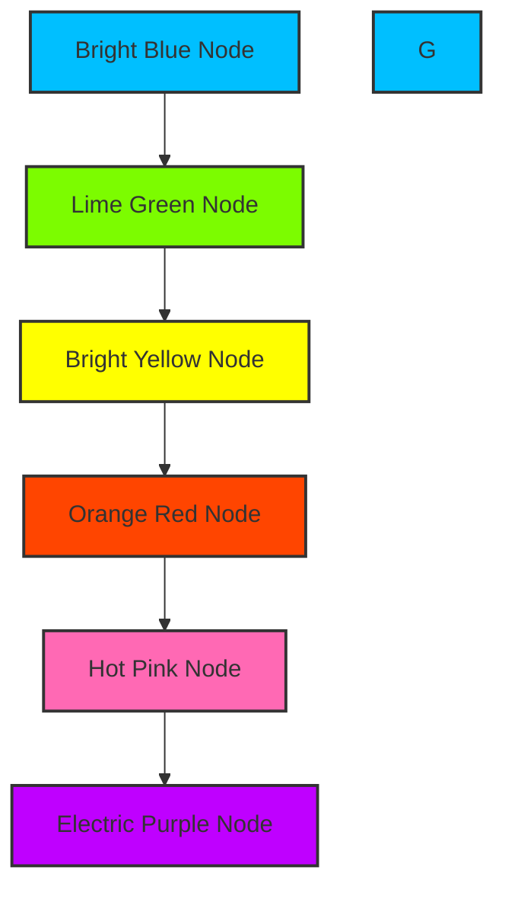

```mermaid
graph TD
    A[Bright Blue Node]
    B[Lime Green Node]
    C[Bright Yellow Node]
    D[Orange Red Node]
    E[Hot Pink Node]
    F[Electric Purple Node]
    G

    A --> B
    B --> C
    C --> D
    D --> E
    E --> F

    style B fill:#7CFC00,stroke:#333,stroke-width:2px;
    style C fill:#FFFF00,stroke:#333,stroke-width:2px;
    style D fill:#FF4500,stroke:#333,stroke-width:2px;
    style E fill:#FF69B4,stroke:#333,stroke-width:2px;
    style F fill:#BF00FF,stroke:#333,stroke-width:2px;
    
    
    classDef brightBlue fill:#00BFFF,stroke:#333,stroke-width:2px;
    
    class A,G brightBlue;

```
