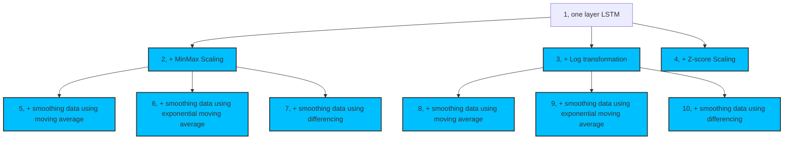

```mermaid
graph TD
    1[1, one layer LSTM] --> 2[2, + MinMax Scaling]
    1 --> 3[3, + Log transformation]
    1 --> 4[4, + Z-score Scaling]
    2 --> 5[5, + smoothing data using moving average]
    2 --> 6[6, + smoothing data using exponential moving average]
    2 --> 7[7, + smoothing data using differencing]
    3 --> 8[8, + smoothing data using moving average]
    3 --> 9[9, + smoothing data using exponential moving average]
    3 --> 10[10, + smoothing data using differencing]
    
    
    classDef brightBlue fill:#00BFFF,stroke:#333,stroke-width:2px;
    class 2,3,4,5,6,7,8,9,10 brightBlue;
    
```