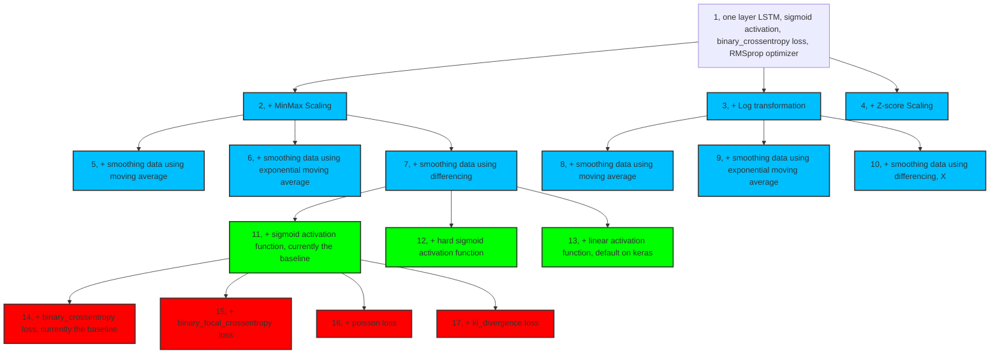

```mermaid
graph TD
    1[1, one layer LSTM, sigmoid activation, binary_crossentropy loss, RMSprop optimizer] --> 2[2, + MinMax Scaling]
    1 --> 3[3, + Log transformation]
    1 --> 4[4, + Z-score Scaling]
    2 --> 5[5, + smoothing data using moving average]
    2 --> 6[6, + smoothing data using exponential moving average]
    2 --> 7[7, + smoothing data using differencing]
    3 --> 8[8, + smoothing data using moving average]
    3 --> 9[9, + smoothing data using exponential moving average]
    3 --> 10[10, + smoothing data using differencing, X]
    7 --> 11[11, + sigmoid activation function, currently the baseline]
    7 --> 12[12, + hard sigmoid activation function]
    7 --> 13[13, + linear activation function, default on keras]
    11 --> 14[14, + binary_crossentropy loss, currently the baseline]
    11 --> 15[15, + binary_focal_crossentropy loss]
    11 --> 16[16, + poisson loss]
    11 --> 17[17, + kl_divergence loss]
    
    
    
    
    classDef brightBlue fill:#00BFFF,stroke:#333,stroke-width:2px;
    class 2,3,4,5,6,7,8,9,10 brightBlue;
    
    classDef brightGreen fill:#00FF00,stroke:#333,stroke-width:2px;
    class 11,12,13 brightGreen;
    
    classDef brightRed fill:#FF0000,stroke:#333,stroke-width:2px;
    class 14,15,16,17 brightRed;
    
    
```