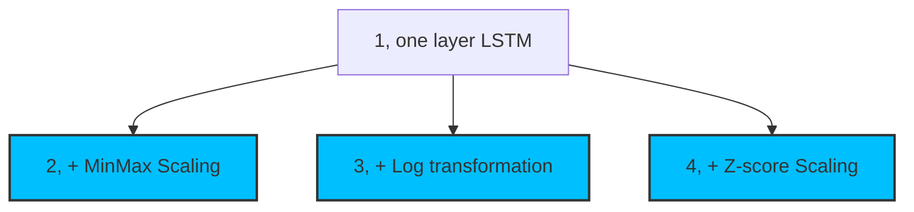

```mermaid
graph TD
    1[1, one layer LSTM] --> 2[2, + MinMax Scaling]
    1 --> 3[3, + Log transformation]
    1 --> 4[4, + Z-score Scaling]
    
    
    
    classDef brightBlue fill:#00BFFF,stroke:#333,stroke-width:2px;
    class 2,3,4 brightBlue;
    
```