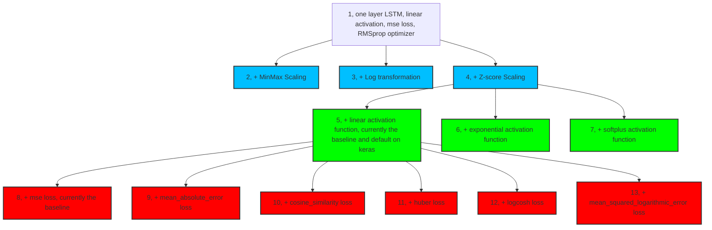

```mermaid
graph TD
    1[1, one layer LSTM, linear activation, mse loss, RMSprop optimizer] --> 2[2, + MinMax Scaling]
    1 --> 3[3, + Log transformation]
    1 --> 4[4, + Z-score Scaling]
    4 --> 5[5, + linear activation function, currently the baseline and default on keras]
    4 --> 6[6, + exponential activation function]
    4 --> 7[7, + softplus activation function]
    5 --> 8[8, + mse loss, currently the baseline]
    5 --> 9[9, + mean_absolute_error loss]
    5 --> 10[10, + cosine_similarity loss]
    5 --> 11[11, + huber loss]
    5 --> 12[12, + logcosh loss]
    5 --> 13[13, + mean_squared_logarithmic_error loss]
    
    
    classDef brightBlue fill:#00BFFF,stroke:#333,stroke-width:2px;
    class 2,3,4 brightBlue;
    
    classDef brightGreen fill:#00FF00,stroke:#333,stroke-width:2px;
    class 5,6,7 brightGreen;
    
    classDef brightRed fill:#FF0000,stroke:#333,stroke-width:2px;
    class 8,9,10,11,12,13 brightRed;
    
```