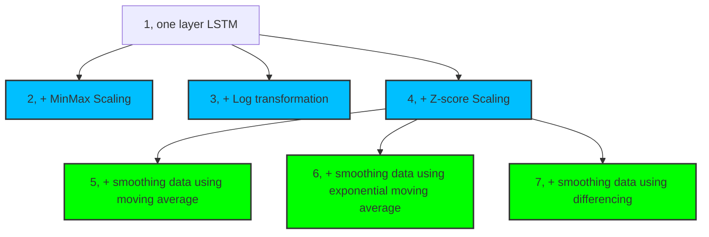

```mermaid
graph TD
    1[1, one layer LSTM] --> 2[2, + MinMax Scaling]
    1 --> 3[3, + Log transformation]
    1 --> 4[4, + Z-score Scaling]
    4 --> 5[5, + smoothing data using moving average]
    4 --> 6[6, + smoothing data using exponential moving average]
    4 --> 7[7, + smoothing data using differencing]
    
    
    
    classDef brightBlue fill:#00BFFF,stroke:#333,stroke-width:2px;
    class 2,3,4 brightBlue;
    
    classDef brightGreen fill:#00FF00,stroke:#333,stroke-width:2px;
    class 5,6,7 brightGreen;
    
```